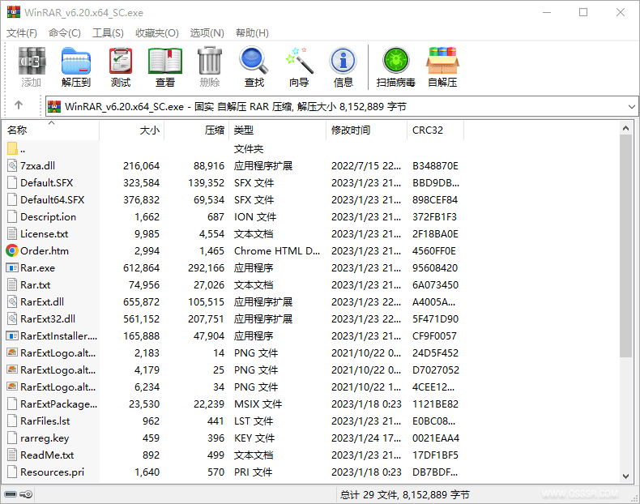

# WinRAR v7.23 64位 官方原版已注册特别版 无广告无修改

WinRAR 是一款功能强大的压缩文件管理工具，用于创建、查看和解压各种常见的压缩文件格式。它的名称源自"Windows RAR"，RAR 是一种流行的文件压缩格式。WinRAR 提供了一系列方便易用的功能，使用户能够在他们的计算机上轻松地处理压缩文件。它支持多种压缩格式，包括RAR、ZIP、CAB、ARJ、LZH、TAR、GZIP、UUE、ISO、BZIP2、Z 和 7-Zip 等。此外，WinRAR 还可以创建自解压执行文件（SFX）和多卷存档，以便将大型文件分割成更小的部分。除了压缩和解压文件之外，还提供了其他有用的功能，例如加密压缩文件、添加注释、修复受损的存档、创建恢复记录和使用额外的数据恢复记录来保护存档免受损坏。

官方网站：https://www.rarlab.com/

## 截屏

## 功能摘要

1. 压缩文件
   - 支持将文件压缩成RAR 或 ZIP 格式，可选择压缩级别和加密方式。
2. 解压缩文件
   - 支持解压缩RAR、ZIP、CAB、ARJ、LZH、TAR、GZ、ACE、UUE、BZ2、JAR、ISO等多种格式的文件。
3. 多卷压缩
   - 支持将大文件分成多个压缩包，方便存储和传输。
4. 加密文件
   - 支持对压缩文件进行加密，保护文件的安全性。
5. 修复损坏的压缩文件
   - 支持修复受损的RAR 和 ZIP 格式的压缩文件。
6. 命令行界面
   - 提供命令行界面，方便用户在命令行下使用。
7. 图形化界面
   - 提供直观的图形化界面，方便用户操作和管理压缩文件。
8. 自解压缩功能
   - 支持创建自解压缩的可执行文件，方便在没有安装WinRAR的环境中解压缩文件。
9. 支持多语言
   - 支持多种语言界面，满足不同用户的需求。

## 更新日志

https://www.rarlab.com/rarnew.htm

## 修改日志

- 跟进官方 7.23 正式版
- 无视锁定，集成Key

## 下载地址

[WinRAR v7.23 64位 官方原版已注册特别版](https://raw.githubusercontent.com/vtechdot/winrar/refs/heads/main/WinRA.v7.23.7z)
